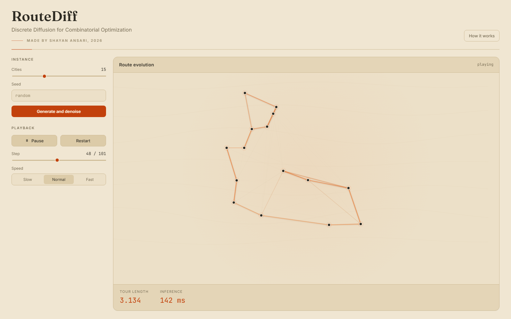

# RouteDiff

A discrete diffusion model for the Traveling Salesperson Problem (TSP), with an
animated web demo that shows a tour emerging from noise.



## What this is

The TSP asks for the shortest cycle that visits every city exactly once, a
classic NP-hard problem. Instead of searching for a tour with a heuristic,
RouteDiff *generates* one with a diffusion model, the same family behind modern
image generators, adapted to a discrete graph. It treats a tour as a set of edges
and learns to denoise a random graph back into a clean, valid route, all running
locally on CPU.

## Setup

```bash
python -m venv venv
venv\Scripts\Activate.ps1            # macOS / Linux: source venv/bin/activate
pip install -r requirements.txt --extra-index-url https://download.pytorch.org/whl/cpu
python -m uvicorn server.app:app
```

## Benchmarks

Results on `N = 15`, optimality gap vs the best method per instance:

| Method            | Mean optimality gap | Mean runtime / instance |
|-------------------|---------------------|-------------------------|
| Nearest-neighbor  | ~15.5%              | ~2 ms                   |
| 2-opt             | ~1.4%               | ~58 ms                  |
| Diffusion (ours)  | ~7.4%               | ~950 ms                 |

For full details see [docs/DETAILS.md](docs/DETAILS.md).
