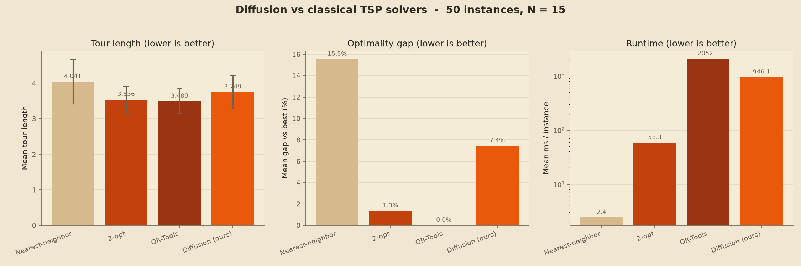

# RouteDiff - Details

Architecture, training, and benchmark details for RouteDiff. For a quick start,
see the [README](../README.md).

---

## The diffusion approach, in plain terms

Most diffusion models corrupt and restore continuous pixels. The TSP has no
pixels, so RouteDiff diffuses over the **edge set** of the graph.

A tour over `N` cities is encoded as a symmetric binary adjacency matrix: for
each of the `N (N - 1) / 2` possible undirected edges, a `1` means "this edge is
in the tour" and a `0` means it is not. A clean tour has exactly `N` edges set
(one cycle through every city).

**Forward process (adding noise).** Following D3PM (Austin et al., *Structured
Denoising Diffusion Models in Discrete State-Spaces*), each edge is a binary
variable that evolves under a uniform-kernel Markov chain. At each timestep `t`,
an edge has some probability of resampling its state uniformly at random;
otherwise it keeps its value. Because the kernel is uniform, the `t`-step
marginal has a closed form:

```
q(edge present | clean value e0) = 0.5 + (e0 - 0.5) * alpha_bar_t
```

where `alpha_bar_t` is the cumulative survival probability from a cosine noise
schedule. At `t = 0` the tour is untouched; at `t = T` every edge is present with
probability one half, i.e. an Erdos-Renyi `G(N, 1/2)` random graph. That random
graph is the prior we sample from at inference time.

**Reverse process (removing noise).** The denoiser uses the `x_0`
parameterization: given a noisy edge set and the timestep `t`, it predicts, for
every edge, the probability that the edge belongs to the *clean* tour. Training
is therefore plain per-edge binary cross-entropy against the known clean tour.
Because a clean tour is sparse (only `N` of the possible edges are present), the
positive class is up-weighted so the model does not collapse to "predict absent".

**Sampling.** Inference starts from a random edge set at `t = T` and walks back to
`t = 0`. At each step the model predicts the clean edges, and a closed-form binary
posterior produces the slightly-less-noisy edge set for the next step. At `t = 0`
the per-edge probabilities are decoded into a guaranteed-valid Hamiltonian cycle
with a greedy, union-find edge selection that forbids premature subtours and
vertices of degree three.

**The model.** The denoiser (`routediff/model.py`) is a small dense, anisotropic
GatedGCN (~130k parameters, hidden width 64, 4 message-passing layers). It
consumes node coordinates, the current noisy edge set with pairwise distances,
and a sinusoidal embedding of the timestep, and outputs one symmetric logit per
edge. It is deliberately tiny so it trains on a CPU in minutes.

---

## Repository layout

```
discrete-route-diffusion/
├── data/generator.py        # synthetic TSP instance generator
├── routediff/
│   ├── graph.py             # distance matrix, tour <-> edge-set converters, tour_length
│   ├── diffusion.py         # forward/reverse discrete diffusion, schedule, loss
│   ├── model.py             # GNN denoiser
│   ├── train.py             # training loop + checkpointing
│   ├── inference.py         # reverse sampling, greedy decode, JSON timeline export
│   └── solvers.py           # nearest-neighbor, 2-opt, optional OR-Tools baselines
├── server/
│   ├── app.py               # FastAPI server (generate / infer / timeline)
│   └── static/              # index.html, style.css, app.js (D3 animation)
├── benchmarks/compare.py    # speed/quality comparison + charts
├── tests/                   # pytest suite
└── requirements.txt
```

---

## Train a model

Model checkpoints are not committed (they are gitignored), so train one first.
Defaults are defined in `TrainConfig` (`routediff/train.py`):

```bash
python -m routediff.train
```

This generates synthetic instances, solves each once for clean target tours,
then trains the denoiser, logging per-epoch loss to the console and
`logs/train.log` and writing checkpoints under `checkpoints/`. With the defaults
(`N = 20`, 512 instances, 50 epochs) this finishes in minutes on a laptop CPU.

To train the configuration used for the demo and benchmarks (`N = 15`), edit
`TrainConfig` or call `train()` from a short script with `num_cities=15`. The
server and benchmark scripts pick up the most recently modified checkpoint
automatically, or you can point them at a specific file with the
`ROUTEDIFF_CHECKPOINT` environment variable.

---

## Run the web demo

Start the FastAPI server (it serves both the API and the static frontend):

```bash
# optional: pin a specific checkpoint
export ROUTEDIFF_CHECKPOINT=checkpoints/n15/denoiser_epoch0250.pt   # PowerShell: $env:ROUTEDIFF_CHECKPOINT="..."

python -m uvicorn server.app:app --host 127.0.0.1 --port 8000
```

Open <http://127.0.0.1:8000>. Set the number of cities (and optionally a seed),
click **Generate and denoise**, and watch the tour emerge from noise. Playback
controls let you pause, restart, scrub step by step, and change speed.

API endpoints, if you want to script it:

| Method | Path            | Purpose                                          |
|--------|-----------------|--------------------------------------------------|
| GET    | `/api/health`   | Liveness plus model/checkpoint status            |
| POST   | `/api/generate` | Sample a fresh instance (city coordinates)       |
| POST   | `/api/infer`    | Denoise an instance, return the animation timeline |
| POST   | `/api/run`      | Generate then infer in one call                  |

The denoiser is a graph network, so it runs at any city count at inference time,
independent of the size it was trained on.

---

## Benchmarks

Compare the diffusion sampler against the classical baselines on a shared,
seeded set of instances:

```bash
python -m benchmarks.compare --num-instances 50 --num-cities 15 \
  --checkpoint checkpoints/n15/denoiser_epoch0250.pt
```

This prints a table and writes `benchmarks/results/results.csv` plus a
parchment-themed chart. Results from the demo checkpoint (`N = 15`, 50
instances):



| Method            | Mean optimality gap | Mean runtime / instance |
|-------------------|---------------------|-------------------------|
| Nearest-neighbor  | ~15.5%              | ~2 ms                   |
| 2-opt             | ~1.4%               | ~58 ms                  |
| OR-Tools          | 0.0% (reference)    | ~2050 ms                |
| Diffusion (ours)  | ~7.4%               | ~950 ms                 |

Optimality gap is measured against the best method per instance. The takeaways
are honest: the diffusion model roughly halves the nearest-neighbor gap and lands
within several percent of the 2-opt and OR-Tools references, while being slower
than the lightweight classical heuristics at this small scale. The point is not
to beat 2-opt on a 15-city laptop benchmark; it is to show that a learned,
generative denoiser can produce high-quality valid tours.

---

## Tests

```bash
python -m pytest
```

The suite covers the generator, graph converters, solvers, the forward/reverse
diffusion math, the model, training (loss decreases, checkpoint round-trips), the
sampler (beats a random tour, valid timeline), and the HTTP API contract. A few
tests are skipped automatically if OR-Tools is not installed.

---

## Honest limitations

- **Scale.** The model is trained and demonstrated on small instances (`N` around
  15-20). It is not a competitor to specialized solvers like LKH or Concorde on
  large problems, and quality and runtime have not been characterized at large
  `N`.
- **Runtime.** Reverse diffusion runs the network once per timestep
  (`T = 100` by default), so a single tour takes on the order of a second on CPU,
  far slower than nearest-neighbor or 2-opt. Fewer timesteps or distillation
  would help; neither is implemented here.
- **Decoding.** The final tour comes from a greedy union-find decode of edge
  probabilities. It guarantees a valid Hamiltonian cycle but is not guaranteed to
  extract the optimal tour from the predicted edge scores.
- **Baselines.** "Optimality gap" is measured against the best method per
  instance (typically 2-opt or OR-Tools), not against a proven optimum, so the
  reported gaps are upper bounds on the true gap.
- **Training labels.** Clean target tours come from heuristic solvers
  (nearest-neighbor + 2-opt, or OR-Tools when available), so the model is
  learning to imitate strong heuristics rather than provably optimal tours.

---

## Tech stack

Python 3.11, PyTorch (CPU build), FastAPI + Uvicorn, vanilla HTML/CSS/JS with
D3.js, Matplotlib for offline charts, and OR-Tools as an optional baseline. See
`requirements.txt` for pinned versions.
